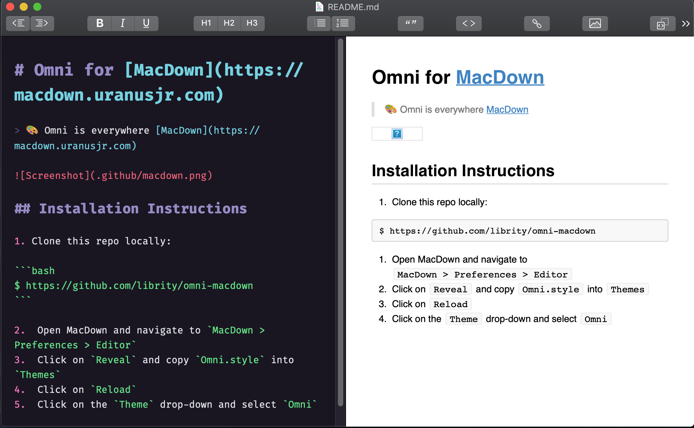

# Omni for [MacDown](https://macdown.uranusjr.com)

> 🎨 Omni is everywhere [MacDown](https://macdown.uranusjr.com)



## Installation Instructions

1. Clone this repo locally:

```bash
$ https://github.com/librity/omni-macdown
```

2.  Open MacDown and navigate to `MacDown > Preferences > Editor`
3.  Click on `Reveal` and copy `Omni.style` into `Themes`
4.  Click on `Reload`
5.  Click on the `Theme` drop-down and select `Omni`
